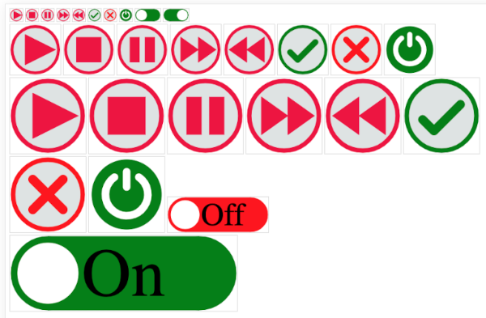

# TUI very light weight HTML UI elements

This project came out of the need for very light weight HTML / GUI icons for embedded ESP32 web server projects.
Every byte counts when it comes to the limited storage space on the ESP32 / LittleFS partitions.
I found that most the contemporary javascript libaries ran into hundreds of kilobytes.

I also wanted to avoid having any image files on the file system.

This library uses Javascript / HTML5 Canvas to create the icons in code on the fly.

Here is a screenshot / sample 

This is very much a work in progress as at 7th Jan 2024

Matt Way